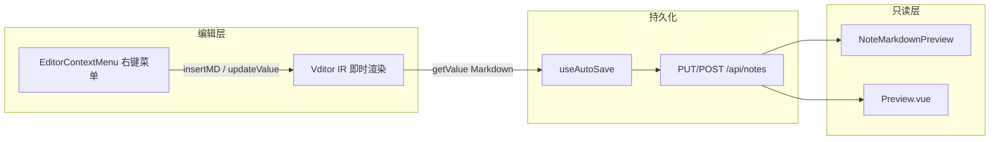
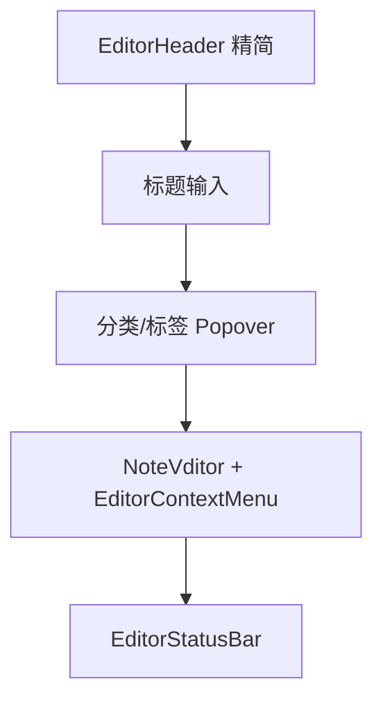

# 笔记模块 Typora 式 WYSIWYG 重构计划

## 背景与目标

| 现状 | 目标 |
|------|------|
| [NoteMdEditor.vue](personal-hub-web/src/modules/knowledge/note/editor/NoteMdEditor.vue) + md-editor-v3（CodeMirror 源码编辑 + 工具栏） | **Vditor IR 模式**（输入即渲染，Typora 体验） |
| 工具栏驱动格式化（[mdEditorToolbars.ts](personal-hub-web/src/modules/knowledge/note/editor/mdEditorToolbars.ts)） | **零工具栏**，全部通过右键菜单触发 |
| 编辑/预览分离（splitpanes + MdPreview） | IR 单栏写作为主；只读预览页统一渲染管道 |
| 无右键菜单 | 参考 [Guanmo EditorContextMenu](https://github.com/we-used-to-be/Guanmo-open/blob/main/src/components/editor/EditorContextMenu.tsx) 的菜单结构与定位逻辑 |

**你已确认**：Typora WYSIWYG + 完整笔记模块重构（列表/编辑/预览/回收站/导入）。

**后端不变**：`Note.content` 仍为 Markdown 字符串，[NoteController](personal-hub-server/ph-knowledge/src/main/java/com/personalhub/knowledge/controller/NoteController.java) / 图片上传 API 无需改动。

---

## 技术选型

### 编辑器：Vditor IR 模式



**选择理由**（相对 Milkdown / 保留 md-editor-v3）：
- 内置 **IR 模式**，最接近 Typora
- 原生支持 **脚注、GFM 表格、KaTeX、Mermaid**
- `insertValue` / `insertMD` / `updateValue` / `getSelection` API 便于右键菜单调用
- `toolbarConfig.hide: true` + `toolbar: []` 可完全隐藏工具栏
- Vue 3 直接 `new Vditor(el, options)` 封装，无需依赖过时的 `vue-vditor`

**依赖变更**（[package.json](personal-hub-web/package.json)）：
- 新增：`vditor@^3.11`
- 移除：`md-editor-v3`（笔记模块完全迁移后）
- 保留：`katex`、`mermaid`（通过 Vditor 配置本地 CDN 路径，延续 [mdEditorSetup.ts](personal-hub-web/src/modules/knowledge/note/editor/mdEditorSetup.ts) 无外部 CDN 策略）

---

## 架构设计

### 1. 新编辑器核心：`NoteVditor.vue`

替换 [NoteMdEditor.vue](personal-hub-web/src/modules/knowledge/note/editor/NoteMdEditor.vue)，职责：

- 初始化 Vditor（`mode: 'ir'`，`toolbar: []`，`toolbarConfig: { hide: true }`）
- `v-model` 双向绑定 Markdown（`input` 回调 + `setValue`）
- 暴露实例方法供右键菜单：`getVditor()`、`focus()`、`getSelection()`
- 集成 [useImageUpload.ts](personal-hub-web/src/modules/knowledge/note/editor/useImageUpload.ts) 的 `upload.handler` 回调
- 主题同步：监听 `data-theme`，调用 `setTheme('dark' | 'classic')`
- 样式：Prose 排版（字号 16px、行高 1.8），匹配 [STYLE_GUIDE](docs/STYLE_GUIDE.md) CSS 变量

关键配置草案：

```typescript
// vditorSetup.ts
{
  mode: 'ir',
  toolbar: [],
  toolbarConfig: { hide: true },
  cache: { enable: false },        // 由 useAutoSave 管理
  counter: { enable: false },      // 由 EditorStatusBar 统计
  preview: {
    markdown: {
      footnotes: true,
      mathBlockPreview: true,
      codeBlockPreview: true,
    },
  },
  upload: { /* 对接现有图片 API */ },
  cdn: '/vditor',                  // vite 静态拷贝，避免 unpkg CDN
}
```

### 2. 右键菜单系统（参考 Guanmo，Vue 化）

新建 `editor/context-menu/` 目录：

| 文件 | 职责 |
|------|------|
| `ContextMenu.vue` | 通用浮层：视口边界修正、click/scroll 关闭（移植 Guanmo [ContextMenu.tsx](https://github.com/we-used-to-be/Guanmo-open/blob/main/src/components/common/ContextMenu.tsx)） |
| `ContextMenuItem.vue` / `ContextMenuSubmenu.vue` / `ContextMenuSeparator.vue` | 菜单原语 |
| `TableGridPicker.vue` | Typora 式 **NxM 表格选择器**（默认 8×6，hover 高亮，点击生成 GFM 表格） |
| `EditorContextMenu.vue` | 编辑区右键菜单主组件 |
| `contextMenuActions.ts` | 纯函数：Markdown 模板 + Vditor API 调用 |
| `useEditorContextMenu.ts` | 菜单状态 `{ x, y, hasSelection }`、打开/关闭 |

**菜单结构**（无工具栏时的完整能力）：

**无选区（空白处右键）**：
- 基础：粘贴 / 全选
- 插入 → 标题（子菜单 H1–H6 + 正文）、引用、无序/有序/任务列表
- 插入 → 链接、链接引用（`[text][ref]` + 底部 `[ref]: url`）、脚注（`[^n]` + 底部定义）
- 插入 → 水平分割线、表格（TableGridPicker 子菜单）、代码块、Mermaid 块、公式块（块级 `$$` / 行内 `$`）、图片

**有选区**：
- 基础：复制
- 格式：加粗 / 斜体 / 删除线 / 行内代码 / 上标 / 下标
- 格式：引用 / 链接（包裹并选中 URL）/ 脚注标记
- 转换：设为 H1–H6 / 正文

**实现模式**（Guanmo 同款，适配 Vditor API）：

```typescript
// contextMenuActions.ts 核心模式
function wrapSelection(vditor, before, after, selectOffset?, selectLen?) {
  const text = vditor.getSelection()
  vditor.updateValue(`${before}${text}${after}`)
  // 通过 getCursorPosition + 二次 focus 定位光标
}
function insertAtCursor(vditor, md, cursorStart?, cursorEnd?) {
  vditor.insertMD(md)
}
function insertTable(vditor, rows, cols) { /* 生成 GFM 表格模板 */ }
function insertFootnote(vditor) { /* 扫描现有 [^n] 自增 */ }
```

**表格生成示例**（8×6 可选）：

```markdown
|  |  |  |
| --- | --- | --- |
|  |  |  |
```

**脚注模板**：

```markdown
正文[^1]

[^1]: 脚注内容
```

### 3. 编辑页重构：[Editor.vue](personal-hub-web/src/modules/knowledge/note/Editor.vue)



**模式简化**（IR 模式下分栏预览冗余）：

| 模式 | 行为 |
|------|------|
| `edit` | Vditor IR 单栏写作（默认） |
| `preview` | 只读 [NoteMarkdownPreview.vue](personal-hub-web/src/modules/knowledge/note/editor/NoteMarkdownPreview.vue) |
| `focus` | 隐藏 AppLayout chrome + Header 最小化，全屏 IR 编辑 |

**移除/降级**：
- 删除 splitpanes 分栏逻辑（~150 行）及 [EditorPreviewPanel.vue](personal-hub-web/src/modules/knowledge/note/editor/EditorPreviewPanel.vue) 在编辑态的使用
- [EditorHeader.vue](personal-hub-web/src/modules/knowledge/note/editor/EditorHeader.vue) 移除「分栏预览」按钮；保留专注/全屏/编辑↔预览切换
- [useEditorMode.ts](personal-hub-web/src/modules/knowledge/note/editor/useEditorMode.ts) 移除 `livePreview` / `toggleLivePreview` / `Ctrl+Shift+L`
- [useEditorPreferences.ts](personal-hub-web/src/modules/knowledge/note/editor/useEditorPreferences.ts) 移除 `splitRatio` 持久化

**保留不变**：
- [useAutoSave.ts](personal-hub-web/src/modules/knowledge/note/editor/useAutoSave.ts)（绑定 `form.content`）
- [EditorStatusBar.vue](personal-hub-web/src/modules/knowledge/note/editor/EditorStatusBar.vue)
- Focus Mode body class 机制
- 分类/标签/收藏/导出/删除

### 4. 统一预览渲染：`NoteMarkdownPreview.vue`

替换 MdPreview，供：
- [Preview.vue](personal-hub-web/src/modules/knowledge/note/Preview.vue) 独立阅读页
- Editor.vue 的 `preview` 模式

实现方式：Vditor 静态预览 API（`Vditor.preview()` 或 `md2html`）+ 现有能力迁移：
- TOC 导航（复用 [parseToc.ts](personal-hub-web/src/modules/knowledge/note/editor/parseToc.ts)）
- 图片代理 + medium-zoom（来自 EditorPreviewPanel）
- 代码块复制按钮
- 阅读主题/字号/行高（[useReadingTheme.ts](personal-hub-web/src/modules/knowledge/note/preview/useReadingTheme.ts)）

确保脚注、表格、公式、Mermaid 在预览页与 IR 编辑态渲染一致。

### 5. 列表/回收站/导入模块

**[List.vue](personal-hub-web/src/modules/knowledge/note/List.vue)**：
- 卡片右键菜单：编辑 / 新标签预览 / 收藏 / 导出 / 移入回收站
- 复用 `ContextMenu` 原语，保持与编辑页交互一致
- 卡片预览文本：strip Markdown 语法（现有逻辑微调）

**[RecycleBin.vue](personal-hub-web/src/modules/knowledge/note/RecycleBin.vue)**：
- 对齐 List 卡片布局与右键菜单（恢复 / 永久删除 / 预览）
- 统一空状态与 skeleton 样式

**[ImportMarkdownDialog.vue](personal-hub-web/src/modules/knowledge/note/ImportMarkdownDialog.vue)**：
- 无需 API 变更；导入后进入新 Editor，Vditor `setValue` 加载内容
- 验证脚注/表格/公式导入后 IR 渲染正常

---

## 文件变更清单

### 新增
- `editor/NoteVditor.vue`
- `editor/vditorSetup.ts`
- `editor/context-menu/ContextMenu.vue`
- `editor/context-menu/ContextMenuItem.vue`
- `editor/context-menu/ContextMenuSubmenu.vue`
- `editor/context-menu/TableGridPicker.vue`
- `editor/context-menu/EditorContextMenu.vue`
- `editor/context-menu/contextMenuActions.ts`
- `editor/context-menu/useEditorContextMenu.ts`
- `editor/NoteMarkdownPreview.vue`
- `editor/__tests__/contextMenuActions.test.ts`（表格/脚注/标题模板单测）

### 修改
- [Editor.vue](personal-hub-web/src/modules/knowledge/note/Editor.vue) — 核心布局重构
- [EditorHeader.vue](personal-hub-web/src/modules/knowledge/note/editor/EditorHeader.vue) — 移除分栏按钮
- [useEditorMode.ts](personal-hub-web/src/modules/knowledge/note/editor/useEditorMode.ts) — 简化模式
- [useEditorPreferences.ts](personal-hub-web/src/modules/knowledge/note/editor/useEditorPreferences.ts) — 清理 split 偏好
- [Preview.vue](personal-hub-web/src/modules/knowledge/note/Preview.vue) — 换用 NoteMarkdownPreview
- [List.vue](personal-hub-web/src/modules/knowledge/note/List.vue) — 卡片右键菜单
- [RecycleBin.vue](personal-hub-web/src/modules/knowledge/note/RecycleBin.vue) — UI 对齐
- [vite.config.ts](personal-hub-web/vite.config.ts) — vditor 静态资源 + chunk 拆分
- [package.json](personal-hub-web/package.json) — 依赖替换

### 删除
- `editor/NoteMdEditor.vue`
- `editor/EditorPreviewPanel.vue`
- `editor/mdEditorToolbars.ts`
- `editor/mdEditorSetup.ts`

---

## Vditor 静态资源策略

在 [vite.config.ts](personal-hub-web/vite.config.ts) 中：
- 使用 `vite-plugin-static-copy` 或 build 脚本将 `node_modules/vditor/dist/` 必要资源复制到 `public/vditor/`
- `cdn` 指向 `/vditor`，KaTeX/Mermaid/highlight 等同理本地化
- 更新 chunk：`vendor-vditor` 替代 `vendor-editor`

---

## 文档同步（提交前必做）

按项目铁律更新：
- [docs/TECH_STACK.md](docs/TECH_STACK.md) — `md-editor-v3` → `vditor`
- [docs/STYLE_GUIDE.md](docs/STYLE_GUIDE.md) — 共享组件表、`Editor Composable` 章节
- [docs/CHANGELOG.md](docs/CHANGELOG.md) — 重构条目
- [README.md](README.md) — 编辑器描述
- [docs/PROJECT.md](docs/PROJECT.md) — 路线图里程碑

---

## 设计文档

已完成：[docs/superpowers/specs/2026-07-15-note-editor-wysiwyg-refactor-design.md](docs/superpowers/specs/2026-07-15-note-editor-wysiwyg-refactor-design.md)

包含：背景目标、Guanmo/Typora 参考、Vditor 选型、右键菜单完整规格、TableGridPicker 交互、模块变更清单、验证清单与风险。

---

## 实施阶段（建议顺序）

### Phase 0 — 设计文档（已完成）
设计规格见 `docs/superpowers/specs/2026-07-15-note-editor-wysiwyg-refactor-design.md`

### Phase 1 — 编辑器内核（2–3 天）
1. 安装 Vditor，创建 `NoteVditor.vue` + `vditorSetup.ts`
2. 替换 Editor.vue 中的 NoteMdEditor，验证 v-model / 自动保存 / 图片上传
3. IR 模式主题与 Focus Mode 样式适配

### Phase 2 — 右键菜单（2–3 天）
1. ContextMenu 原语 + EditorContextMenu 框架
2. 实现全部插入/格式化 action（H1–H6、脚注、链接引用、分割线、代码块、公式、列表、引用）
3. TableGridPicker 组件
4. `contextMenuActions` 单元测试

### Phase 3 — 编辑页收尾（1 天）
1. 简化 EditorHeader / useEditorMode / useEditorPreferences
2. 移除 splitpanes 相关代码
3. 清理 md-editor-v3 编辑态依赖

### Phase 4 — 预览与列表模块（1–2 天）
1. NoteMarkdownPreview 替换 MdPreview（Preview.vue + Editor preview 模式）
2. List / RecycleBin 右键菜单与 UI 统一
3. ImportMarkdownDialog 回归测试

### Phase 5 — 文档与验证（0.5 天）
1. 更新 docs
2. 全链路手动验证清单（见下）
3. `pnpm build` + 后端测试无回归

---

## 验证清单

| 场景 | 预期 |
|------|------|
| 新建笔记 → 右键插入 H3 / 表格 3×4 / 脚注 / 公式块 | IR 即时渲染正确 |
| 选中文本 → 右键加粗 / 设链接 | 包裹正确，光标定位合理 |
| 粘贴 / 全选 / 复制 | 正常工作 |
| 图片右键插入 + 拖拽粘贴 | 上传至 `/api/notes/{id}/images` |
| 自动保存 2s 防抖 + Ctrl+S | 状态栏 dirty/saving/success |
| Focus Mode + Esc 退出 | chrome 隐藏/恢复 |
| Preview.vue 阅读主题/TOC/脚注 | 渲染与编辑态一致 |
| 列表卡片右键 → 预览/删除 | 菜单可用 |
| 导入 .md 含 GFM 扩展语法 | 内容完整加载 |
| 暗色主题切换 | Vditor + 预览同步 |

---

## 风险与应对

| 风险 | 应对 |
|------|------|
| Vditor IR 与现有 Markdown 内容兼容性 | 用现有笔记样本做导入/渲染回归；保留 Markdown 纯文本存储 |
| Vditor 包体较大（~22MB） | vite 分包 + 静态资源按需加载；仅笔记路由 lazy load |
| 右键菜单与浏览器默认菜单冲突 | `@contextmenu.prevent` + 仅在 `.vditor-ir` 区域触发 |
| 脚注编号冲突 | `insertFootnote` 扫描文档现有 `[^n]` 自增 |
| md-editor-v3 移除影响其他模块 | 已确认仅 note 模块使用，可安全移除 |

---

## 不在本次范围

- 后端 API / 数据库变更
- AI 助手右键菜单（Guanmo 有，Personal Hub 无此能力）
- 日记模块编辑器迁移（仍可用旧 MarkdownEditor，后续独立任务）
- 多标签页编辑（Guanmo TabBar，非 Personal Hub 现有能力）
